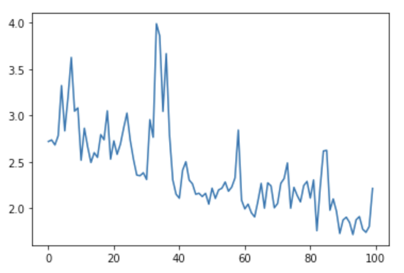

::: questions
- What is a neural network?
- How do I compose a Neural Network using Keras?
- How do I train this network on a dataset?
- How do I get insight into learning process?
- How do I measure the performance of the network?
:::

::: objectives
- Use the deep learning workflow to structure the notebook
- Explore the dataset using pandas and seaborn
- Use one-hot encoding to prepare data for classification in Keras
- Describe a fully connected layer
- Implement a fully connected layer with Keras
- Use Keras to train a small fully connected network on prepared data
- Interpret the loss curve of the training process
- Use a confusion matrix to measure the trained networks' performance on a test set
:::


## Introduction
In this episode we will learn how to create and train a Neural Network using Keras to solve a simple classification task.

The goal of this episode is to quickly get your hands dirty in actually defining and training a neural network, without going into depth of how neural networks work on a technical or mathematical level.
We want you to go through the most commonly used deep learning workflow that was covered
in the introduction.
As a reminder below are the steps of the deep learning workflow:

1. Formulate / Outline the problem
2. Identify inputs and outputs
3. Prepare data
4. Choose a pretrained model or start building architecture from scratch
5. Choose a loss function and optimizer
6. Train the model
7. Perform a Prediction/Classification
8. Measure performance
9. Refine the model
10. Save model

In this episode we will focus on a minimal example for each of these steps, later episodes will build on this knowledge to go into greater depth for some or all of these steps.

::: instructor
This episode really aims to go through the whole process once, as quickly as possible. 
In episode 3 we will expand on all the concepts that are lightly inroduced in episode 2. Some concepts like monitoring the training progress, optimization and learning rate are explained in detail in episode 3.
It is good to stress this a few times, because learners will usually have a lot of questions like:
'Why don't we normalize our features' or 'Why do we choose Adam optimizer?'. 
It can be a good idea to park some of these questions for discussion in episode 3 and 4.
:::

::: callout
## GPU usage
For this lesson having a GPU (graphics card) available is not needed.
We specifically use very small toy problems so that you do not need one.
However, Keras will use your GPU automatically when it is available.
Using a GPU becomes necessary when tackling larger datasets or complex problems which
require a more complex Neural Network.
:::

## 1. Formulate/outline the problem: penguin classification
In this episode we will be using the [penguin dataset](https://zenodo.org/record/3960218), this is a dataset that was published in 2020 by Allison Horst and contains data on three different species of the penguins.

We will use the penguin dataset to train a neural network which can classify which species a
penguin belongs to, based on their physical characteristics.

::: callout
## Goal
The goal is to predict a penguins' species using the attributes available in this dataset.
:::

The `palmerpenguins` data contains size measurements for three penguin species observed on three islands in the Palmer Archipelago, Antarctica.
The physical attributes measured are flipper length, beak length, beak width, body mass, and sex.

![*Artwork by @allison_horst*][palmer-penguins]


![*Artwork by @allison_horst*][penguin-beaks]


These data were collected from 2007 - 2009 by Dr. Kristen Gorman with the [Palmer Station Long Term Ecological Research Program](https://pal.lternet.edu/), part of the [US Long Term Ecological Research Network](https://lternet.edu/). The data were imported directly from the [Environmental Data Initiative](https://environmentaldatainitiative.org/) (EDI) Data Portal, and are available for use by CC0 license ("No Rights Reserved") in accordance with the [Palmer Station Data Policy](https://pal.lternet.edu/data/policies).

## 2. Identify inputs and outputs
To identify the inputs and outputs that we will use to design the neural network we need to familiarize
ourselves with the dataset. This step is sometimes also called data exploration.

We will start by importing the [Seaborn](https://seaborn.pydata.org/) library that will help us get the dataset and visualize it.
Seaborn is a powerful library with many visualizations. Keep in mind it requires the data to be in a
pandas dataframe, luckily the datasets available in seaborn are already in a pandas dataframe.

```python
import seaborn as sns
```

We can load the penguin dataset using
```python
penguins = sns.load_dataset('penguins')
```

This will give you a pandas dataframe which contains the penguin data.

### Inspecting the data
Using the pandas `head` function gives us a quick look at the data:
```python
penguins.head()
```

 |       | species | island | bill_length_mm | bill_depth_mm | flipper_length_mm | body_mass_g | sex  |
 |------:|---------------:|--------------:|------------------:|------------:|------------:|------------:|------------:|
 | 0 | Adelie | Torgersen | 39.1 | 18.7 | 181.0 | 3750.0 | Male   |
 | 1 | Adelie | Torgersen | 39.5 | 17.4 | 186.0 | 3800.0 | Female |
 | 2 | Adelie | Torgersen | 40.3 | 18.0 | 195.0 | 3250.0 | Female |
 | 3 | Adelie | Torgersen | NaN  | NaN  | NaN   | NaN    | NaN    |
 | 4 | Adelie | Torgersen | 36.7 | 19.3 | 193.0 | 3450.0 | Female |

 All columns but the 'species' columns are features that we can use.

Let's look at the shape of the dataset:

 ```python
 penguins.shape
 ```

There are 344 samples and 7 columns, so 6 features

### Visualization
Looking at numbers like this usually does not give a very good intuition about the data we are
working with, so let us create a visualization.

#### Pair Plot
One nice visualization for datasets with relatively few attributes is the Pair Plot.
This can be created using `sns.pairplot(...)`. It shows a scatterplot of each attribute plotted against each of the other attributes.
By using the `hue='species'` setting for the pairplot the graphs on the diagonal are layered kernel density estimate plots for the different values of the `species` column.

```python
sns.pairplot(penguins, hue="species")
```

![][pairplot]

::: challenge

## Pairplot

Take a look at the pairplot we created. Consider the following questions:

* Is there any class that is easily distinguishable from the others?
* Which combination of attributes shows the best separation for all 3 class labels at once?
* (optional) Create a similar pairplot, but with `hue="sex"`. Explain the patterns you see.
Which combination of features distinguishes the two sexes best?

:::: solution
## Solution
* The plots show that the green class, Gentoo is somewhat more easily distinguishable from the other two.
* The other two seem to be separable by a combination of bill length and bill
depth (other combinations are also possible such as bill length and flipper length).

Answer to optional question:

```python
sns.pairplot(penguins, hue='sex')
```

![][sex_pairplot]

You see that for each species females have smaller bills and flippers, as well as a smaller body mass.
You would need a combination of the species and the numerical features to successfully distinguish males from females.
The combination of `bill_depth_mm` and `body_mass_g` gives the best separation.

::::
:::

### Input and Output Selection
Now that we have familiarized ourselves with the dataset we can select the data attributes to use
as input for the neural network and the target that we want to predict.

In the rest of this episode we will use the `bill_length_mm`, `bill_depth_mm`, `flipper_length_mm`, `body_mass_g` attributes.
The target for the classification task will be the `species`.

::: callout
## Data Exploration
Exploring the data is an important step to familiarize yourself with the problem and to help you
determine the relevant inputs and outputs.
:::

## 3. Prepare data
The input data and target data are not yet in a format that is suitable to use for training a neural network.


For now we will only use the numerical features `bill_length_mm`, `bill_depth_mm`, `flipper_length_mm`, `body_mass_g` only,
so let's drop the categorical columns:
```python
# Drop categorical columns
penguins_filtered = penguins.drop(columns=['island', 'sex'])
```

### Clean missing values
During the exploration phase you may have noticed that some rows in the dataset have missing (NaN)
values, leaving such values in the input data will ruin the training, so we need to deal with them.
There are many ways to deal with missing values, but for now we will just remove the offending rows by adding a call to `dropna()`:
```python
# Drop the rows that have NaN values in them
penguins_filtered = penguins_filtered.dropna()
```

Finally, we select only the features
```python
# Extract columns corresponding to features
features = penguins_filtered.drop(columns=['species'])
```

### Prepare target data for training
Second, the target data is also in a format that cannot be used in training.
A neural network can only take numerical inputs and outputs, and learns by
calculating how "far away" the species predicted by the neural network is
from the true species.
When the target is a string category column as we have here it is very difficult to determine this "distance" or error.
Therefore we will transform this column into a more suitable format.
Again there are many ways to do this, however we will be using the one-hot encoding.
This encoding creates multiple columns, as many as there are unique values, and
puts a 1 in the column with the corresponding correct class, and 0's in
the other columns.
For instance, for a penguin of the Adelie species the one-hot encoding would be 1 0 0

Fortunately pandas is able to generate this encoding for us.
```python
import pandas as pd

target = pd.get_dummies(penguins_filtered['species'])
target.head() # print out the top 5 to see what it looks like.
```

::: challenge
## One-hot encoding
How many output neurons will our network have now that we one-hot encoded the target class?

* A: 1
* B: 2
* C: 3

:::: solution
## Solution
C: 3, one for each output variable class

::::
:::

### Split data into training and test set
Finally, we will split the dataset into a training set and a test set.
As the names imply we will use the training set to train the neural network,
while the test set is kept separate.
We will use the test set to assess the performance of the trained neural network
on unseen samples.
In many cases a validation set is also kept separate from the training and test sets (i.e. the dataset is split into 3 parts).
This validation set is then used to select the values of the parameters of the neural network and the training methods.
For this episode we will keep it at just a training and test set however.

To split the cleaned dataset into a training and test set we will use a very convenient
function from sklearn called `train_test_split`.

This function takes a number of parameters which are extensively explained in [the scikit-learn documentation](https://scikit-learn.org/stable/modules/generated/sklearn.model_selection.train_test_split.html) :
- The first two parameters are the dataset (in our case `features`) and the corresponding targets (i.e. defined as target).
- Next is the named parameter `test_size` this is the fraction of the dataset that is
used for testing, in this case `0.2` means 20% of the data will be used for testing.
- `random_state` controls the shuffling of the dataset, setting this value will reproduce
the same results (assuming you give the same integer) every time it is called.
- `shuffle` which can be either `True` or `False`, it controls whether the order of the rows of the dataset is shuffled before splitting. It defaults to `True`.
- `stratify` is a more advanced parameter that controls how the split is done. By setting it to `target` the train and test sets the function will return will have roughly the same proportions (with regards to the number of penguins of a certain species) as the dataset.

```python
from sklearn.model_selection import train_test_split

X_train, X_test, y_train, y_test = train_test_split(features, target, test_size=0.2, random_state=0, shuffle=True, stratify=target)
```

::: instructor
## BREAK
This is a good time for switching instructor and/or a break.
:::

## 4. Build an architecture from scratch or choose a pretrained model

### Keras for neural networks
We will now build our first neural network from scratch. Although this sounds like a daunting task, you will experience that with [Keras](https://keras.io/) it is actually surprisingly straightforward.

Keras is a machine learning framework with ease of use as one of its main features.
It is part of the tensorflow python package and can be imported using `from tensorflow import keras`.

Keras includes functions, classes and definitions to define deep learning models, cost functions and optimizers (optimizers are used to train a model).

Before we move on to the next section of the workflow we need to make sure we have Keras imported.
We do this as follows:
```python
from tensorflow import keras
```

For this class it is useful if everyone gets the same results from their training.
Keras uses a random number generator at certain points during its execution.
Therefore we will need to set two random seeds, one for numpy and one for tensorflow:
```python
from numpy.random import seed
seed(1)
keras.utils.set_random_seed(2)
```

### Build a neural network from scratch

Now we will build a neural network from scratch, and although this sounds like
a daunting task, with Keras it is actually surprisingly straightforward.

With Keras you compose a neural network by creating layers and linking them
together. For now we will only use one type of layer called a fully connected
or Dense layer. In Keras this is defined by the `keras.layers.Dense` class.

A dense layer has a number of neurons, which is a parameter you can choose when
you create the layer.
When connecting the layer to its input and output layers every neuron in the dense
layer gets an edge (i.e. connection) to ***all*** of the input neurons and ***all*** of the output neurons.
The hidden layer in the image in the introduction of this episode is a Dense layer.

The input in Keras also gets special treatment, Keras automatically calculates the number of inputs
and outputs a layer needs and therefore how many edges need to be created.
This means we need to inform Keras how big our input is going to be. We do this by instantiating a `keras.Input` class and tell it how big our input is, thus the number of columns it contains.

```python
inputs = keras.Input(shape=(X_train.shape[1],))
```

We store a reference to this input class in a variable so we can pass it to the creation of
our hidden layer.
Creating the hidden layer can then be done as follows:
```python
hidden_layer = keras.layers.Dense(10, activation="relu")(inputs)
```

The instantiation here has 2 parameters and a seemingly strange combination of parentheses, so
let us take a closer look.
The first parameter `10` is the number of neurons we want in this layer, this is one of the
hyperparameters of our system and needs to be chosen carefully. We will get back to this in the section
on refining the model.
The second parameter is the activation function to use, here we choose relu which is 0
for inputs that are 0 and below and the identity function (returning the same value)
for inputs above 0.
This is a commonly used activation function in deep neural networks that is proven to work well.
Next we see an extra set of parenthenses with inputs in them, this means that after creating an
instance of the Dense layer we call it as if it was a function.
This tells the Dense layer to connect the layer passed as a parameter, in this case the inputs.
Finally we store a reference so we can pass it to the output layer in a minute.

Now we create another layer that will be our output layer.
Again we use a Dense layer and so the call is very similar to the previous one.
```python
output_layer = keras.layers.Dense(3, activation="softmax")(hidden_layer)
```

Because we chose the one-hot encoding, we use `3` neurons for the output layer.

The softmax activation ensures that the three output neurons produce values in the range
(0, 1) and they sum to 1.
We can interpret this as a kind of 'probability' that the sample belongs to a certain
species.

Now that we have defined the layers of our neural network we can combine them into
a Keras model which facilitates training the network.
```python
model = keras.Model(inputs=inputs, outputs=output_layer)
model.summary()
```

The model summary here can show you some information about the neural network we have defined.

::: callout
## Trainable and non-trainable parameters
Keras distinguishes between two types of weights, namely:

- trainable parameters: these are weights of the neurons that are modified when we train the model in order to minimize our loss function (we will learn about loss functions shortly!).

- non-trainable parameters: these are weights of the neurons that are not changed when we train the model. These could be for many reasons - using a pre-trained model, choice of a particular filter for a convolutional neural network, and statistical weights for batch normalization are some examples.  

If these reasons are not clear right away, don't worry! In later episodes of this course, we will touch upon a couple of these concepts.
::: 

::: challenge
## Create the neural network
With the code snippets above, we defined a Keras model with 1 hidden layer with
10 neurons and an output layer with 3 neurons.

1. How many parameters does the resulting model have?
2. What happens to the number of parameters if we increase or decrease the number of neurons
 in the hidden layer?

#### (optional) Keras Sequential vs Functional API
So far we have used the [Functional API](https://keras.io/guides/functional_api/) of Keras.
You can also implement neural networks using [the Sequential model](https://keras.io/guides/sequential_model/).
As you can read in the documentation, the Sequential model is appropriate for **a plain stack of layers**
where each layer has **exactly one input tensor and one output tensor**.

3. (optional) Use the Sequential model to implement the same network

:::: solution
## Solution
Have a look at the output of `model.summary()`:
```python
model.summary()
```

```output
Model: "model_1"
_________________________________________________________________
Layer (type)                 Output Shape              Param #
=================================================================
input_1 (InputLayer)         [(None, 4)]               0
_________________________________________________________________
dense (Dense)                (None, 10)                50
_________________________________________________________________
dense_1 (Dense)              (None, 3)                 33
=================================================================
Total params: 83
Trainable params: 83
Non-trainable params: 0
_________________________________________________________________
```
The model has 83 trainable parameters.

If you increase the number of neurons in the hidden layer the number of
trainable parameters in both the hidden and output layer increases or
decreases in accordance with the number of neurons added.
Each extra neuron has 4 weights connected to the input layer, 1 bias term, and 3 weights connected to the output layer.
So in total 8 extra parameters.

*The name in quotes within the string `Model: "model_1"` may be different in your view; this detail is not important.*

#### (optional) Keras Sequential vs Functional API
3. This implements the same model using the Sequential API:
```python
model = keras.Sequential(
    [
        keras.Input(shape=X_train.shape[1]),
        keras.layers.Dense(10, activation="relu"),
        keras.layers.Dense(3, activation="softmax"),
    ]
)
```

We will use the Functional API for the remainder of this course, since it is more flexible and more explicit.
::::
:::


::: callout
## How to choose an architecture?
Even for this small neural network, we had to make a choice on the number of hidden neurons.
Other choices to be made are the number of layers and type of layers (as we will see later).
You might wonder how you should make these architectural choices.
Unfortunately, there are no clear rules to follow here, and it often boils down to a lot of
trial and error. However, it is recommended to look what others have done with similar datasets and problems.
Another best practice is to start with a relatively simple architecture. Once running start to add layers and tweak the network to see if performance increases.
:::

### Choose a pretrained model
If your data and problem is very similar to what others have done, you can often use a *pretrained network*.
Even if your problem is different, but the data type is common (for example images), you can use a pretrained network and finetune it for your problem.
A large number of openly available pretrained networks can be found in the [Model Zoo](https://modelzoo.co/), [pytorch hub](https://pytorch.org/hub/) or [tensorflow hub](https://www.tensorflow.org/hub/).


## 5. Choose a loss function and optimizer
We have now designed a neural network that in theory we should be able to
train to classify Penguins.
However, we first need to select an appropriate loss
function that we will use during training.
This loss function tells the training algorithm how wrong, or how 'far away' from the true
value the predicted value is.

For the one-hot encoding that we selected before a fitting loss function is the Categorical Crossentropy loss.
In Keras this is implemented in the `keras.losses.CategoricalCrossentropy` class.
This loss function works well in combination with the `softmax` activation function
we chose earlier.
The Categorical Crossentropy works by comparing the probabilities that the
neural network predicts with 'true' probabilities that we generated using the one-hot encoding.
This is a measure for how close the distribution of the three neural network outputs corresponds to the distribution of the three values in the one-hot encoding.
It is lower if the distributions are more similar.

For more information on the available loss functions in Keras you can check the
[documentation](https://www.tensorflow.org/api_docs/python/tf/keras/losses).

Next we need to choose which optimizer to use and, if this optimizer has parameters, what values
to use for those. Furthermore, we need to specify how many times to show the training samples to the optimizer.

Once more, Keras gives us plenty of choices all of which have their own pros and cons,
but for now let us go with the widely used [Adam optimizer](https://www.tensorflow.org/api_docs/python/tf/keras/optimizers/Adam).
Adam has a number of parameters, but the default values work well for most problems.
So we will use it with its default parameters.

Combining this with the loss function we decided on earlier we can now compile the
model using `model.compile`.
Compiling the model prepares it to start the training.

```python
model.compile(optimizer='adam', loss=keras.losses.CategoricalCrossentropy())
```

## 6. Train model
We are now ready to train the model.

Training the model is done using the `fit` method, it takes the input data and
target data as inputs and it has several other parameters for certain options
of the training.
Here we only set a different number of `epochs`.
One training epoch means that every sample in the training data has been shown
to the neural network and used to update its parameters.

```python
history = model.fit(X_train, y_train, epochs=100)
```

The fit method returns a history object that has a history attribute with the training loss and
potentially other metrics per training epoch.
It can be very insightful to plot the training loss to see how the training progresses.
Using seaborn we can do this as follow:
```python
sns.lineplot(x=history.epoch, y=history.history['loss'])
```
![][training_curve]

This plot can be used to identify whether the training is well configured or whether there
are problems that need to be addressed.

::: challenge
## The Training Curve
Looking at the training curve we have just made.

1. How does the training progress?
   * Does the training loss increase or decrease?
   * Does it change quickly or slowly?
   * Does the graph look very jittery?
2. Do you think the resulting trained network will work well on the test set?

When the training process does not go well:

3. (optional) Something went wrong here during training. What could be the problem, and how do you see that in the training curve?
Also compare the range on the y-axis with the previous training curve.
{alt='Very jittery training curve with the loss value jumping back and forth between 2 and 4. The range of the y-axis is from 2 to 4, whereas in the previous training curve it was from 0 to 2. The loss seems to decrease a litle bit, but not as much as compared to the previous plot where it dropped to almost 0. The minimum loss in the end is somewhere around 2.'}

:::: solution
## Solution
1. The training loss decreases quickly. It drops in a smooth line with little jitter.
This is ideal for a training curve.
2. The results of the training give very little information on its performance on a test set.
  You should be careful not to use it as an indication of a well trained network.
3. (optional) The loss does not go down at all, or only very slightly. This means that the model is not learning anything.
It could be that something went wrong in the data preparation (for example the labels are not attached to the right features).
In addition, the graph is very jittery. This means that for every update step,
the weights in the network are updated in such a way that the loss sometimes increases a lot and sometimes decreases a lot.
This could indicate that the weights are updated too much at every learning step and you need a smaller learning rate
(we will go into more details on this in the next episode).
Or there is a high variation in the data, leading the optimizer to change the weights in different directions at every learning step.
This could be addressed by presenting more data at every learning step (or in other words increasing the batch size).
In this case the graph was created by training on nonsense data, so this a training curve for a problem where nothing can be learned really.

We will take a closer look at training curves in the next episode. Some of the concepts touched upon here will also be further explained there.

::::
:::

## 7. Perform a prediction/classification
Now that we have a trained neural network, we can use it to predict new samples
of penguin using the `predict` function.

We will use the neural network to predict the species of the test set
using the `predict` function.
We will be using this prediction in the next step to measure the performance of our
trained network.
This will return a `numpy` matrix, which we convert
to a pandas dataframe to easily see the labels.
```python
y_pred = model.predict(X_test)
prediction = pd.DataFrame(y_pred, columns=target.columns)
prediction
```
|     |          |           |          |
| --: | -------: | --------: | -------: |
| 0   | 0.304484 | 0.192893  | 0.502623 |
| 1   | 0.527107 | 0.095888  | 0.377005 |
| 2   | 0.373989 | 0.195604  | 0.430406 |
| 3   | 0.493643 | 0.154104  | 0.352253 |
| 4   | 0.309051 | 0.308646  | 0.382303 |
| ... | ...      | ...       | ...      |
| 64  | 0.406074 | 0.191430  | 0.402496 |
| 65  | 0.645621 | 0.077174  | 0.277204 |
| 66  | 0.356284 | 0.185958  | 0.457758 |
| 67  | 0.393868 | 0.159575  | 0.446557 |
| 68  | 0.509837 | 0.144219  | 0.345943 |


Remember that the output of the network uses the `softmax` activation function and has three
outputs, one for each species. This dataframe shows this nicely.

We now need to transform this output to one penguin species per sample.
We can do this by looking for the index of highest valued output and converting that
to the corresponding species.
Pandas dataframes have the `idxmax` function, which will do exactly that.

```python
predicted_species = prediction.idxmax(axis="columns")
predicted_species
```

```output
0     Gentoo
1     Adelie
2     Gentoo
3     Adelie
4     Gentoo
      ...
64    Adelie
65    Adelie
66    Gentoo
67    Gentoo
68    Adelie
Length: 69, dtype: object
```


::: instructor
## BREAK
This is a good time for switching instructor and/or a break.
:::

## 8. Measuring performance
Now that we have a trained neural network it is important to assess how well it performs.
We want to know how well it will perform in a realistic prediction scenario, measuring
performance will also come back when refining the model.

We have created a test set (i.e. y_test) during the data preparation stage which we will use
now to create a confusion matrix.

### Confusion matrix
With the predicted species we can now create a confusion matrix and display it
using seaborn.
To create a confusion matrix we will use another convenient function from sklearn
called `confusion_matrix`.
This function takes as a first parameter the true labels of the test set.
We can get these by using the `idxmax` method on the y_test dataframe.
The second parameter is the predicted labels which we did above.

```python
from sklearn.metrics import confusion_matrix

true_species = y_test.idxmax(axis="columns")

matrix = confusion_matrix(true_species, predicted_species)
print(matrix)
```
```output
[[22  0  8]
 [ 5  0  9]
 [ 6  0 19]]
```

Unfortunately, this matrix is kinda hard to read. Its not clear which column and which row
corresponds to which species.
So let's convert it to a pandas dataframe with its index and columns set to the species
as follows:

```python
# Convert to a pandas dataframe
confusion_df = pd.DataFrame(matrix, index=y_test.columns.values, columns=y_test.columns.values)

# Set the names of the x and y axis, this helps with the readability of the heatmap.
confusion_df.index.name = 'True Label'
confusion_df.columns.name = 'Predicted Label'
```

We can then use the `heatmap` function from seaborn to create a nice visualization of
the confusion matrix.
The `annot=True` parameter here will put the numbers from the confusion matrix in
the heatmap.

```python
sns.heatmap(confusion_df, annot=True)
```
![][confusion_matrix]

::: challenge
## Confusion Matrix
Measure the performance of the neural network you trained and
visualize a confusion matrix.

- Did the neural network perform well on the test set?
- Did you expect this from the training loss you saw?
- What could we do to improve the performance?

:::: solution
## Solution
The confusion matrix shows that the predictions for Adelie and Gentoo
are decent, but could be improved. However, Chinstrap is not predicted
ever.
The training loss was very low, so from that perspective this may be
surprising.
But this illustrates very well why a test set is important when training
neural networks.
We can try many things to improve the performance from here.
One of the first things we can try is to balance the dataset better.
Other options include: changing the network architecture or changing the
training parameters

Note that the outcome you have might be slightly different from what is shown in this tutorial.
::::
:::

## 9. Refine the model
As we discussed before the design and training of a neural network comes with
many hyperparameter and model architecture choices.
We will go into more depth of these choices in later episodes.
For now it is important to realize that the parameters we chose were
somewhat arbitrary and more careful consideration needs to be taken to
pick hyperparameter values. 


## 10. Share model
It is very useful to be able to use the trained neural network at a later
stage without having to retrain it.
This can be done by using the `save` method of the model.
It takes a string as a parameter which is the path of a directory where the model is stored.

```python
model.save('my_first_model')
```

This saved model can be loaded again by using the `load_model` method as follows:
```python
pretrained_model = keras.models.load_model('my_first_model')
```

This loaded model can be used as before to predict.

```python
# use the pretrained model here
y_pretrained_pred = pretrained_model.predict(X_test)
pretrained_prediction = pd.DataFrame(y_pretrained_pred, columns=target.columns.values)

# idxmax will select the column for each row with the highest value
pretrained_predicted_species = pretrained_prediction.idxmax(axis="columns")
print(pretrained_predicted_species)
```

```output
0     Adelie
1     Gentoo
2     Adelie
3     Gentoo
4     Gentoo
      ...
64    Gentoo
65    Gentoo
66    Adelie
67    Adelie
68    Gentoo
Length: 69, dtype: object
```


[palmer-penguins]: fig/palmer_penguins.png "Palmer Penguins"
{alt='Illustration of the three species of penguins found in the Palmer Archipelago, Antarctica: Chinstrap, Gentoo and Adele'}

[penguin-beaks]: fig/culmen_depth.png "Culmen Depth"
{alt='Illustration of the beak dimensions called culmen length and culmen depth in the dataset'}

[pairplot]: fig/pairplot.png "Pair Plot"
{alt='Pair plot showing the separability of the three species of penguin for combinations of dataset attributes'}

[sex_pairplot]: fig/02_sex_pairplot.png "Pair plot grouped by sex"
{alt='Pair plot showing the separability of the two sexes of penguin for combinations of dataset attributes'}

[training_curve]: fig/02_training_curve.png "Training Curve"
{alt='Training loss curve of the neural network training which depicts exponential decrease in loss before a plateau from ~10 epochs'}

[confusion_matrix]: fig/confusion_matrix.png "Confusion Matrix"
{alt='Confusion matrix of the test set with high accuracy for Adelie and Gentoo classification and no correctly predicted Chinstrap'}


:::: keypoints
- The deep learning workflow is a useful tool to structure your approach, it helps to make sure you do not forget any important steps.
- Exploring the data is an important step to familiarize yourself with the problem and to help you determine the relavent inputs and outputs.
- One-hot encoding is a preprocessing step to prepare labels for classification in Keras.
- A fully connected layer is a layer which has connections to all neurons in the previous and subsequent layers.
- keras.layers.Dense is an implementation of a fully connected layer, you can set the number of neurons in the layer and the activation function used.
- To train a neural network with Keras we need to first define the network using layers and the Model class. Then we can train it using the model.fit function.
- Plotting the loss curve can be used to identify and troubleshoot the training process.
- The loss curve on the training set does not provide any information on how well a network performs in a real setting.
- Creating a confusion matrix with results from a test set gives better insight into the network's performance.
::::
