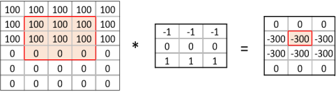
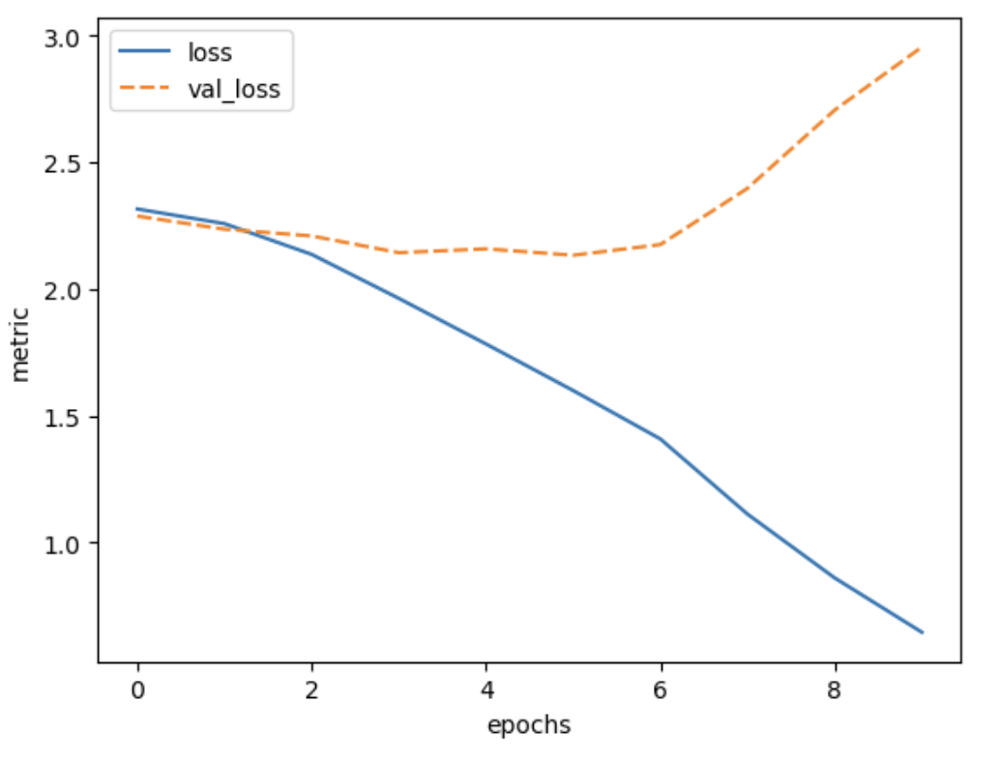
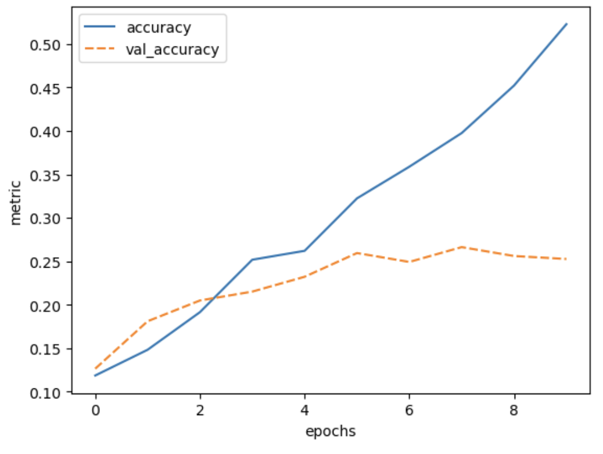

::: questions
- "Why do we need different types of layers?"
- "What are good network designs for image data?"
- "What is a convolutional layer?"
- "How can we use different types of layers to prevent overfitting?"
:::

::: objectives
- "Understand why convolutional and pooling layers are useful for image data"
- "Implement a convolutional neural network on an image dataset"
- "Use a drop-out layer to prevent overfitting"
:::


## Different types of layers
Networks are like onions: a typical neural network consists of many layers. In fact, the word *deep* in *Deep Learning*
refers to the many layers that make the network deep.

So far, we have seen one type of layer, namely the **fully connected**, or **dense** layer. This layer is called fully connected, because all input neurons are taken into account by each output neuron. The number of parameters that need to be learned by the network, is thus in the order of magnitude of the number of input neurons times the number of hidden neurons.

However, there are many different types of layers that perform different calculations and take different inputs. In this episode we will take a look at **convolutional layers** and **dropout layers**, which are useful in the context of image data, but also in many other types of (structured) data.

## 1. Formulate / Outline the problem: Image classification
Keras comes with a few prepared datasets. We have a look at the [CIFAR10 dataset](https://www.cs.toronto.edu/~kriz/cifar.html),
which is a widely known dataset for image classification.
```python
from tensorflow import keras
(train_images, train_labels), (test_images, test_labels) = keras.datasets.cifar10.load_data()
```

::: callout
## CERTIFICATE_VERIFY_FAILED error when downloading CIFAR-10 dataset
When loading the CIFAR-10 dataset, you might get the following error:
```
[SSL: CERTIFICATE_VERIFY_FAILED] certificate verify failed: certificate has expired (_ssl.c:1125)
```
You can solve this error by adding this to your notebook:
```python
import ssl
ssl._create_default_https_context = ssl._create_unverified_context
```
:::

## CIFAR-10

The CIFAR-10 dataset consists of images of 10 different classes: airplanes, cars, birds, cats, deer, dogs, frogs, horses, ships, and trucks.
It is widely used as a benchmark dataset for image classification. The low resolution of the images in the dataset allows for quick loading and testing models.

For more information about this dataset and how it was collected you can check out
[Learning Multiple Layers of Features from Tiny Images by  Alex Krizhevsky, 2009](https://www.cs.toronto.edu/~kriz/learning-features-2009-TR.pdf).


{alt="A 5 by 5 grid of 25 sample images from the CIFAR-10 data-set. Each image is labelled with a category, for example: 'frog' or 'horse'."}

We take a small sample of the data as training set for demonstration purposes.
```python
n = 5000
train_images = train_images[:n]
train_labels = train_labels[:n]
```


## 2. Identify inputs and outputs

## Explore the data

Let's do a quick exploration of the dimensions of the data:
```python
train_images.shape
```
```output
(5000, 32, 32, 3)
```

The first value, `5000`, is the number of training images that we have selected.
The remainder of the shape, namely `32, 32, 3)`, denotes
the dimension of one image. The last value 3 is typical for color images,
and stands for the three color channels **R**ed, **G**reen, **B**lue.

::: challenge

## Number of features CIFAR-10

How many features does one image in the CIFAR-10 dataset have?

- A. 32
- B. 1024
- C. 3072
- D. 5000


:::: solution
The correct solution is C: 3072. There are 1024 pixels in one image (32 * 32),
each pixel has 3 channels (RGB). So 1024 * 3 = 3072.
::::
:::


We can find out the range of values of our input data as follows:
```python
train_images.min(), train_images.max()
```
```output
(0, 255)
```
So the values of the three channels range between `0` and `255`.
Lastly, we inspect the dimension of the labels:
```python
train_labels.shape
```

```output
(5000, 1)
```
So we have, for each image, a single value denoting the label.
To find out what the possible values of these labels are:
```python
train_labels.min(), train_labels.max()
```

```output
(0, 9)
```

The values of the labels range between `0` and `9`, denoting 10 different classes.

## 3. Prepare data

The training set consists of 50000 images of `32x32` pixels and 3 channels (RGB values). The RGB values are between `0` and `255`. For input of neural networks, it is better to have small input values. So we normalize our data between `0` and `1`:


```python
train_images = train_images / 255.0
test_images = test_images / 255.0
```

## 4. Choose a pretrained model or start building architecture from scratch

## Convolutional layers
In the previous episodes, we used 'fully connected layers' , that connected all input values of a layer to all outputs of a layer.
This results in many connections, and thus many weights to be learned, in the network.
Note that our input dimension is now quite high (even with small pictures of `32x32` pixels): we have 3072 features.

::: challenge
## Number of parameters
Suppose we create a single Dense (fully connected) layer with 100 hidden units that connect to the input pixels, how many parameters does this layer have?

- A. 307200
- B. 307300
- C. 100
- D. 3072

:::: solution
## Solution
The correct answer is B: Each entry of the input dimensions, i.e. the `shape` of one single data point, is connected with 100 neurons of our hidden layer, and each of these neurons has a bias term associated to it. So we have `307300` parameters to learn.
```python
width, height = (32, 32)
n_hidden_neurons = 100
n_bias = 100
n_input_items = width * height * 3
n_parameters = (n_input_items * n_hidden_neurons) + n_bias
n_parameters
```
```output
307300
```
We can also check this by building the layer in Keras:
```python
inputs = keras.Input(shape=dim)
outputs = keras.layers.Dense(100)(inputs)
model = keras.models.Model(inputs=inputs, outputs=outputs)
model.summary()
```
```output
Model: "model"
_________________________________________________________________
Layer (type)                 Output Shape              Param #
=================================================================
input_1 (InputLayer)         [(None, 3072)]            0
_________________________________________________________________
dense (Dense)                (None, 100)               307300
=================================================================
Total params: 307,300
Trainable params: 307,300
Non-trainable params: 0
_________________________________________________________________
```
::::
:::

We can decrease the number of units in our hidden layer, but this also decreases the number of patterns our network can remember. Moreover, if we increase the image size, the number of weights will 'explode', even though the task of recognizing large images is not necessarily more difficult than the task of recognizing small images.

The solution is that we make the network learn in a 'smart' way. The features that we learn should be similar both for small and large images, and similar features (e.g. edges, corners) can appear anywhere in the image (in mathematical terms: *translation invariant*). We do this by making use of a concepts from image processing that precede Deep Learning.

A **convolution matrix**, or **kernel**, is a matrix transformation that we 'slide' over the image to calculate features at each position of the image. For each pixel, we calculate the matrix product between the kernel and the pixel with its surroundings. A kernel is typically small, between 3x3 and 7x7 pixels. We can for example think of the 3x3 kernel:
```output
[[-1, -1, -1],
 [0, 0, 0]
 [1, 1, 1]]
```
This kernel will give a high value to a pixel if it is on a horizontal border between dark and light areas.
Note that for RGB images, the kernel should also have a depth of 3.

In the following image, we see the effect of such a kernel on the values of a single-channel image. The red cell in the output matrix is the result of multiplying and summing the values of the red square in the input, and the kernel. Applying this kernel to a real image shows that it indeed detects horizontal edges.
{alt='Example of a convolution matrix calculation'}

{alt='Convolution example on an image of a cat to extract features'}

In our **convolutional layer** our hidden units are a number of convolutional matrices (or kernels), where the values of the matrices are the weights that we learn in the training process. The output of a convolutional layer is an 'image' for each of the kernels, that gives the output of the kernel applied to each pixel.

::: callout
## Playing with convolutions
Convolutions applied to images can be hard to grasp at first. Fortunately there are resources out
there that enable users to interactively play around with images and convolutions:

- [Image kernels explained](https://setosa.io/ev/image-kernels/) shows how different convolutions can achieve certain effects on an image, like sharpening and blurring.
- [The convolutional neural network cheat sheet](https://stanford.edu/~shervine/teaching/cs-230/cheatsheet-convolutional-neural-networks#)
     shows animated examples of the different components of convolutional neural nets 
:::

::: challenge
## Border pixels
What, do you think, happens to the border pixels when applying a convolution?

:::: solution
## Solution
There are different ways of dealing with border pixels.
You can ignore them, which means that your output image is slightly smaller then your input.
It is also possible to 'pad' the borders, e.g. with the same value or with zeros, so that the convolution can also be applied to the border pixels.
In that case, the output image will have the same size as the input image.
[A callout in the Data Carpentry: Image Processing with Python curriculum](https://datacarpentry.org/image-processing/06-blurring.html#callout4)
provides more detail about convolution at the boundaries of an image,
in the context of applying a _Gaussian blur_.
::::
:::

::: challenge
## Number of model parameters
Suppose we apply a convolutional layer with 100 kernels of size 3 * 3 * 3 (the last dimension applies to the rgb channels) to our images of 32 * 32 * 3 pixels. How many parameters do we have? Assume, for simplicity, that the kernels do not use bias terms. Compare this to the answer of the previous exercise

:::: solution
## Solution
We have 100 matrices with 3 * 3 * 3 = 27 values each so that gives 27 * 100 = 2700 weights. This is a magnitude of 100 less than the fully connected layer with 100 units! Nevertheless, as we will see, convolutional networks work very well for image data. This illustrates the expressiveness of convolutional layers.
::::
:::

So let us look at a network with a few convolutional layers. We need to finish with a Dense layer to connect the output cells of the convolutional layer to the outputs for our classes.

```python
inputs = keras.Input(shape=train_images.shape[1:])
x = keras.layers.Conv2D(50, (3, 3), activation='relu')(inputs)
x = keras.layers.Conv2D(50, (3, 3), activation='relu')(x)
x = keras.layers.Flatten()(x)
outputs = keras.layers.Dense(10)(x)

model = keras.Model(inputs=inputs, outputs=outputs, name="cifar_model_small")

model.summary()
```

::: challenge
## Convolutional Neural Network

Inspect the network above:

* What do you think is the function of the `Flatten` layer?
* Which layer has the most parameters? Do you find this intuitive?
* (optional) Pick a model from https://paperswithcode.com/sota/image-classification-on-cifar-10 . Try to understand how it works.

:::: solution
## Solution
* The Flatten layer converts the 28x28x50 output of the convolutional layer into a single one-dimensional vector, that can be used as input for a dense layer.
* The last dense layer has the most parameters. This layer connects every single output 'pixel' from the convolutional layer to the 10 output classes.
That results in a large number of connections, so a large number of parameters. This undermines a bit the expressiveness of the convolutional layers, that have much fewer parameters.
::::
:::

Often in convolutional neural networks, the convolutional layers are intertwined with **Pooling layers**. As opposed to the convolutional layer, the pooling layer actually alters the dimensions of the image and reduces it by a scaling factor. It is basically decreasing the resolution of your picture. The rationale behind this is that higher layers of the network should focus on higher-level features of the image. By introducing a pooling layer, the subsequent convolutional layer has a broader 'view' on the original image.

Let's put it into practice. We compose a Convolutional network with two convolutional layers and two pooling layers.


```python
def create_nn():
    inputs = keras.Input(shape=train_images.shape[1:])
    x = keras.layers.Conv2D(50, (3, 3), activation='relu')(inputs)
    x = keras.layers.MaxPooling2D((2, 2))(x) # a new maxpooling layer
    x = keras.layers.Conv2D(50, (3, 3), activation='relu')(x)
    x = keras.layers.MaxPooling2D((2, 2))(x) # a new maxpooling layer (same as maxpool)
    x = keras.layers.Flatten()(x)
    x = keras.layers.Dense(50, activation='relu')(x) # a new Dense layer
    outputs = keras.layers.Dense(10)(x)

    model = keras.Model(inputs=inputs, outputs=outputs, name="cifar_model")
    return model

model = create_nn()
model.summary()
```
```output
Model: "cifar_model"
_________________________________________________________________
 Layer (type)                Output Shape              Param #
=================================================================
 input_6 (InputLayer)        [(None, 32, 32, 3)]       0

 conv2d_13 (Conv2D)          (None, 30, 30, 50)        1400

 max_pooling2d_8 (MaxPooling  (None, 15, 15, 50)       0
 2D)

 conv2d_14 (Conv2D)          (None, 13, 13, 50)        22550

 max_pooling2d_9 (MaxPooling  (None, 6, 6, 50)         0
 2D)

 conv2d_15 (Conv2D)          (None, 4, 4, 50)          22550

 flatten_5 (Flatten)         (None, 800)               0

 dense_9 (Dense)             (None, 50)                40050

 dense_10 (Dense)            (None, 10)                510

=================================================================
Total params: 87,060
Trainable params: 87,060
Non-trainable params: 0
_________________________________________________________________
```
## 5. Choose a loss function and optimizer

We compile the model using the adam optimizer (other optimizers could also be used here!).
Similar to the penguin classification task, we will use the crossentropy function to calculate the model's loss.
This loss function is appropriate to use when the data has two or more label classes.

To calculate crossentropy loss for data that has its classes represented by integers (i.e., not one-hot encoded), we use the SparseCategoricalCrossentropy() function:
```python
def compile_model(model):
    model.compile(optimizer='adam',
                  loss=keras.losses.SparseCategoricalCrossentropy(from_logits=True),
                  metrics=['accuracy'])
compile_model(model)
```

## 6. Train the model

We then train the model for 10 epochs:

```python
history = model.fit(train_images, train_labels, epochs=10,
                    validation_data=(test_images, test_labels))
```

## 7. Perform a Prediction/Classification
Here we skip performing a prediction, and continue to measuring the performance.
In practice, you will only do this step once in a while when you actually need to have the individual predictions,
often you know enough based on the evaluation metric scores.
Of course, behind the scenes whenever you measure performance you have to make predictions and compare them to the ground truth.

## 8. Measure performance

We can plot the training process using the history:

```python
import seaborn as sns
import matplotlib.pyplot as plt
import pandas as pd

def plot_history(history, metrics):
    """
    Plot the training history

    Args:
        history (keras History object that is returned by model.fit())
        metrics(str, list): Metric or a list of metrics to plot
    """
    history_df = pd.DataFrame.from_dict(history.history)
    sns.lineplot(data=history_df[metrics])
    plt.xlabel("epochs")
    plt.ylabel("metric")
plot_history(history, ['accuracy', 'val_accuracy'])
```
{alt='Plot of training accuracy and validation accuracy vs epochs for the trained model'}

```python
plot_history(history, ['loss', 'val_loss'])
```

{alt='Plot of training loss and validation loss vs epochs for the trained model'}

It seems that the model is overfitting somewhat, because the validation accuracy and loss stagnates.

## 9. Tune hyperparameters

::: challenge
## Network depth
What, do you think, will be the effect of adding a convolutional layer to your model? Will this model have more or fewer parameters?
Try it out. Create a `model` that has an additional `Conv2d` layer with 50 filters after the last MaxPooling2D layer. Train it for 20 epochs and plot the results.

**HINT**:
The model definition that we used previously needs to be adjusted as follows:
```python
inputs = keras.Input(shape=train_images.shape[1:])
x = keras.layers.Conv2D(50, (3, 3), activation='relu')(inputs)
x = keras.layers.MaxPooling2D((2, 2))(x)
x = keras.layers.Conv2D(50, (3, 3), activation='relu')(x)
x = keras.layers.MaxPooling2D((2, 2))(x)
# Add your extra layer here
x = keras.layers.Flatten()(x)
x = keras.layers.Dense(50, activation='relu')(x)
outputs = keras.layers.Dense(10)(x)
```

:::: solution

## Solution
We add an extra Conv2D layer after the second pooling layer:
```python
def create_nn_extra_layer():
    inputs = keras.Input(shape=train_images.shape[1:])
    x = keras.layers.Conv2D(50, (3, 3), activation='relu')(inputs)
    x = keras.layers.MaxPooling2D((2, 2))(x)
    x = keras.layers.Conv2D(50, (3, 3), activation='relu')(x)
    x = keras.layers.MaxPooling2D((2, 2))(x) #
    x = keras.layers.Conv2D(50, (3, 3), activation='relu')(x) # estra layer
    x = keras.layers.Flatten()(x)
    x = keras.layers.Dense(50, activation='relu')(x) # a new Dense layer
    outputs = keras.layers.Dense(10)(x)

    model = keras.Model(inputs=inputs, outputs=outputs, name="cifar_model")
    return model

model = create_nn_extra_layer()
```

With the model defined above, we can inspect the number of parameters:
```python
model.summary()
```
```output
Model: "cifar_model"
_________________________________________________________________
Layer (type)                Output Shape              Param #
=================================================================
input_7 (InputLayer)        [(None, 32, 32, 3)]       0
conv2d_16 (Conv2D)          (None, 30, 30, 50)        1400
max_pooling2d_10 (MaxPoolin  (None, 15, 15, 50)       0
g2D)
conv2d_17 (Conv2D)          (None, 13, 13, 50)        22550
max_pooling2d_11 (MaxPoolin  (None, 6, 6, 50)         0
g2D)
conv2d_18 (Conv2D)          (None, 4, 4, 50)          22550
flatten_6 (Flatten)         (None, 800)               0
dense_11 (Dense)            (None, 50)                40050
dense_12 (Dense)            (None, 10)                510
=================================================================
Total params: 87,060
Trainable params: 87,060
Non-trainable params: 0
_________________________________________________________________
```
The number of parameters has decreased by adding this layer.
We can see that the conv layer decreases the resolution from 6x6 to 4x4,
as a result, the input of the Dense layer is smaller than in the previous network.
To train the network and plot the results:
```python
compile_model(model)
history = model.fit(train_images, train_labels, epochs=20,
                   validation_data=(test_images, test_labels))
plot_history(history, ['accuracy', 'val_accuracy'])
```
{alt="Plot of training accuracy and validation accuracy vs epochs for the trained model"}
```python
plot_history(history, ['loss', 'val_loss'])
```

{alt: "Plot of training loss and validation loss vs epochs for the trained model"}

::::
:::

::: callout
## Other types of data
Convolutional and Pooling layers are also applicable to different types of
data than image data. Whenever the data is ordered in a (spatial) dimension,
and *translation invariant* features are expected to be useful, convolutions
can be used. Think for example of time series data from an accelerometer,
audio data for speech recognition, or 3d structures of chemical compounds.
:::

::: challenge
## Why and when to use convolutional neural networks
1. Would it make sense to train a convolutional neural network (CNN) on the penguins dataset and why?
2. Would it make sense to train a CNN on the weather dataset and why?
3. (Optional) Can you think of a different machine learning task that would benefit from a
  CNN architecture?

:::: solution
## Solution
1. No that would not make sense. Convolutions only work when the features of the data can be ordered 
  in a meaningful way. Pixels for example are ordered in a spatial dimension. 
  This kind of order cannot be applied to the features of the penguin dataset.
  If we would have pictures or audio recordings of the penguins as input data
  it would make sense to use a CNN architecture.
2. It would make sense, but only if we approach the problem from a different angle then we did before.
  Namely, 1D convolutions work quite well on sequential data such as timeseries. If we have as our input a matrix
  of the different weather conditions over time in the past x days, a CNN would be suited to quickly grasp
  the temporal relationship over days.
3. Some example domains in which CNNs are applied:
  - Text data
  - Timeseries, specifically audio
  - Molecular structures
::::
:::

## Dropout

Note that the training loss continues to decrease, while the validation loss stagnates, and even starts to increase over the course of the epochs. Similarly, the accuracy for the validation set does not improve anymore after some epochs. This means we are overfitting on our training data set.

Techniques to avoid overfitting, or to improve model generalization, are termed **regularization techniques**.
One of the most versatile regularization technique is **dropout** ([Srivastava et al., 2014](https://jmlr.org/papers/v15/srivastava14a.html)).
Dropout essentially means that during each training cycle a random fraction of the dense layer nodes are turned off. This is described with the dropout rate between 0 and 1 which determines the fraction of nodes to silence at a time.

{alt='A sketch of a neural network with and without dropout'}

The intuition behind dropout is that it enforces redundancies in the network by constantly removing different elements of a network. The model can no longer rely on individual nodes and instead must create multiple "paths". In addition, the model has to make predictions with much fewer nodes and weights (connections between the nodes).
As a result, it becomes much harder for a network to memorize particular features. At first this might appear a quiet drastic approach which affects the network architecture strongly.
In practice, however, dropout is computationally a very elegant solution which does not affect training speed. And it frequently works very well.

**Important to note:** Dropout layers will only randomly silence nodes during training! During a predictions step, all nodes remain active (dropout is off). During training, the sample of nodes that are silenced are different for each training instance, to give all nodes a chance to observe enough training data to learn its weights.

Let us add one dropout layer towards the end of the network, that randomly drops 20% of the input units.

```python
def create_nn_with_dropout():
    inputs = keras.Input(shape=train_images.shape[1:])
    x = keras.layers.Conv2D(50, (3, 3), activation='relu')(inputs)
    x = keras.layers.MaxPooling2D((2, 2))(x)
    x = keras.layers.Conv2D(50, (3, 3), activation='relu')(x)
    x = keras.layers.MaxPooling2D((2, 2))(x)
    x = keras.layers.Conv2D(50, (3, 3), activation='relu')(x)
    x = keras.layers.Dropout(0.8)(x) # This is new!
    x = keras.layers.Flatten()(x)
    x = keras.layers.Dense(50, activation='relu')(x)
    outputs = keras.layers.Dense(10)(x)
    model = keras.Model(inputs=inputs, outputs=outputs, name="cifar_model")
    return model

model_dropout = create_nn_with_dropout()
model_dropout.summary()
```
```output
Model: "cifar_model"
_________________________________________________________________
 Layer (type)                Output Shape              Param #
=================================================================
 input_8 (InputLayer)        [(None, 32, 32, 3)]       0

 conv2d_19 (Conv2D)          (None, 30, 30, 50)        1400

 max_pooling2d_12 (MaxPoolin  (None, 15, 15, 50)       0
 g2D)

 conv2d_20 (Conv2D)          (None, 13, 13, 50)        22550

 max_pooling2d_13 (MaxPoolin  (None, 6, 6, 50)         0
 g2D)

 conv2d_21 (Conv2D)          (None, 4, 4, 50)          22550

 dropout_2 (Dropout)         (None, 4, 4, 50)          0

 flatten_7 (Flatten)         (None, 800)               0

 dense_13 (Dense)            (None, 50)                40050

 dense_14 (Dense)            (None, 10)                510

=================================================================
Total params: 87,060
Trainable params: 87,060
Non-trainable params: 0
_________________________________________________________________
```

We can see that the dropout does not alter the dimensions of the image, and has zero parameters.

We again compile and train the model.
```python
compile_model(model_dropout)

history = model_dropout.fit(train_images, train_labels, epochs=20,
                    validation_data=(test_images, test_labels))
```

And inspect the training results:
```python
plot_history(history, ['accuracy', 'val_accuracy'])

test_loss, test_acc = model_dropout.evaluate(test_images,  test_labels, verbose=2)
```
```output
313/313 - 2s - loss: 1.4683 - accuracy: 0.5307
```

{alt="Plot of training accuracy and validation accuracy vs epochs for the trained model"}

```python
plot_history(history, ['loss', 'val_loss'])
```

{alt="Plot of training loss and validation loss vs epochs for the trained model"}


Now we see that the gap between the training accuracy and validation accuracy is much smaller, and that the final accuracy on the validation set is higher than without dropout.
Nevertheless, there is still some difference between the training loss and validation loss, so we could experiment with regularization even more.

::: challenge
## Vary dropout rate
1. What do you think would happen if you lower the dropout rate? Try it out, and
  see how it affects the model training.
2. You are varying the dropout rate and checking its effect on the model performance,
  what is the term associated to this procedure?

:::: solution
## Solution
### 1. Varying the dropout rate
The code below instantiates and trains a model with varying dropout rates.
You can see from the resulting plot that the ideal dropout rate in this case is around 0.45.
This is where the test loss is lowest.

- NB1: It takes a while to train these 5 networks.
- NB2: In the real world you should do this with a validation set and not with the test set!

```python
def create_nn_with_dropout(dropout_rate):
    inputs = keras.Input(shape=train_images.shape[1:])
    x = keras.layers.Conv2D(50, (3, 3), activation='relu')(inputs)
    x = keras.layers.MaxPooling2D((2, 2))(x)
    x = keras.layers.Conv2D(50, (3, 3), activation='relu')(x)
    x = keras.layers.MaxPooling2D((2, 2))(x)
    x = keras.layers.Conv2D(50, (3, 3), activation='relu')(x)
    x = keras.layers.Dropout(dropout_rate)(x)
    x = keras.layers.Flatten()(x)
    x = keras.layers.Dense(50, activation='relu')(x)
    outputs = keras.layers.Dense(10)(x)
    model = keras.Model(inputs=inputs, outputs=outputs, name="cifar_model")
    return model

dropout_rates = [0.15, 0.3, 0.45, 0.6, 0.75]
test_losses = []
for dropout_rate in dropout_rates:
    model_dropout = create_nn_with_dropout(dropout_rate)
    compile_model(model_dropout)
    model_dropout.fit(train_images, train_labels, epochs=20,
                    validation_data=(test_images, test_labels))

    test_loss, test_acc = model_dropout.evaluate(test_images,  test_labels)
    test_losses.append(test_loss)

loss_df = pd.DataFrame({'dropout_rate': dropout_rates, 'test_loss': test_losses})

sns.lineplot(data=loss_df, x='dropout_rate', y='test_loss')
```

{alt="Plot of test loss vs dropout rate used in the model. The test loss varies between 1.26 and 1.40 and is lowest with a dropout_rate around 0.45."}

### 2. Term associated to this procedure
This is called hyperparameter tuning.
::::
:::

## 10. Share model
Let's save our model

```python
model.save('cnn_model')
```

::: keypoints
- "Convolutional layers make efficient reuse of model parameters."
- "Pooling layers decrease the resolution of your input"
- "Dropout is a way to prevent overfitting"
:::
